# Beginner's Journey on Data Science Process

_You may want to have a coffee while reading this_

## Introduction

Let's get this out of the way: I'm a coffee lover. To be honest, I'm currently taking a sip of coffee while doing this post. That's why when I was given options as to which data I'll base my capstone project for Udacity's Data Scientist Nanodegree program, it's a no brainer that it will be the Starbucks Capstone Challenge.

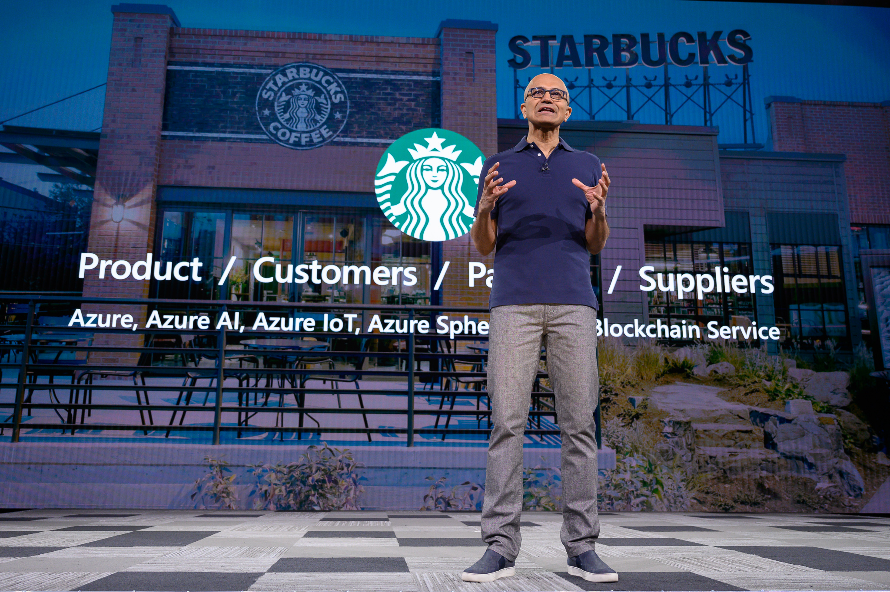

Starbucks, the largest coffee chain in the world, was founded in Seattle, Washington in 1971. But coffee is not the only thing that is popular at Starbucks. For ~5 years, it's no secret that they are investing a lot in data science. I was in Seattle in 2017 for the Microsoft Build when I first heard about Starbucks and what they are doing on the data science side of things Their booth at the event demonstrated the results of their data science studies by providing recommendations on their drive-by monitor. I think they called that project [Deep Brew](https://www.youtube.com/watch?v=XxK1PyaF1bw).

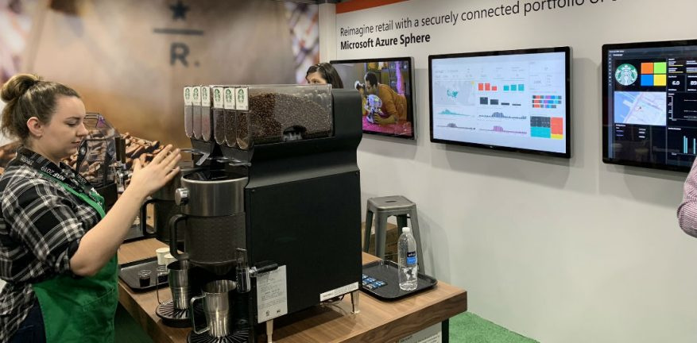

The data obtained from the project, which is about randomized promotion offerings to customers that were carried out in 7 waves within a month duration. Normally, experiments starts out this way as there's no way for us to know what the customer wants. This maybe the usual data science process for Starbucks since there's no data available for them to analyze yet.

And, this is where my journey begins. I'm a software architect by profession with around 20 years of experience in this field, trying to dive in the world of Data Science, with no deep statistical background and I felt everything starts from scratch. I know there are a lot of people like me and hopefully, this post will help you as I try to give out the easiest trick I learned along the way to get you started in the data science field right away.

## The Starbucks Business

Starbucks is sending out these offers and the reason is to get more loyal customers and to have them spend more. As the company gets more happy and loyal customers, this translates to a continuous revenue for the business. Giving out promotions is one way to boost customer satisfaction, a strategy that is not new either. Back in the days, we were getting a lot of coupons in our mailbox, but as we move to digital age, businesses are also doing this virtually as this is faster and cheaper.

In it's effort to keep up with digitization, Starbucks has developed it's own application, which I am also a member. The app functions in two ways: first, as a place where you can browse and purchase coffee; and second, as a medium to send out promotions directly to customers. It can be said that a lot of efforts has been poured into the development of the app for it to be able to surpass credit cards and Apple Pay in terms of payment transactions in the US.

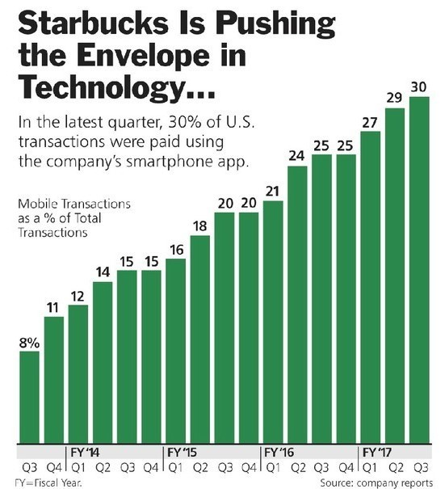

With its popularity, the app has become the perfect channel to push out promotions because consumers will have direct access to them. This is what this study is all about: Starbucks provided a simulated transaction data in their Starbucks mobile app in response to the promotions or experiments done within a month. What we are going to do is to try to evaluate how effective the experiment was in terms of getting the response rates of customers and how these offers influence their spending patterns.

In this study, we will try to answer the following questions:

1. Which offer yields the best results?
2. Which offer/s make the customers spend more?
3. In preparation for the next experiment, how can we make use of the results to improve our offerings to customer?

## The Story of Data

What does the data from the Starbucks app tells us? Let's find out.

The data provided is from a simulation that mimics customer behavior in Starbucks rewards mobile app. We are provided with three datasets:

* Portfolio - a list of offers given and some information about these offers
* Profile - contains some basic user information about the customers
* Transcript - a running timeline of different customer events recorded in mobile app

Let's have a closer look at each dataset.

### Portfolio

This dataset contains 10 offers varying from discount, buy-one-get-one (bogo) and informational. **Discount** types gives a fraction of the difficulty (amount to spend first) as reward. The reward ranges from ~20-40%, while the difficulty ranges from 7 up to 20. Currency is not stated here, so we'll be assuming that they are all on the same currency, unless specified otherwise. The **buy-one-get-one (bogo)** type is the most generous as it gives the exact difficulty amount value as reward (that's why it's called buy-one-get-one). Difficulty and reward for this type ranges from 5 to 10 only. Lastly, the **informational** type just sends out push advertisements to users with no corresponding reward. Normally, these are good for new product announcements that will be offered for a limited time. This promotion is the cheapest among the offers because no reward is given to customers.

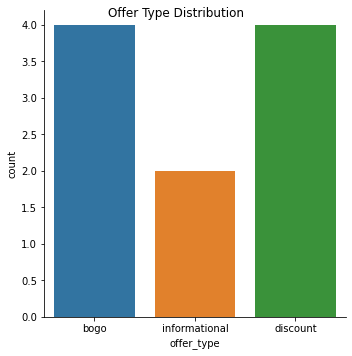

These offers are sent out to one or more of the following channels: web, email, mobile or social media. Among the offers, bogo and discount has the most occurrence, while there are only two instances of informational.

**Data Cleaning**

Although this table is really small, the id is of type `GUID`, which is not readable when explaining things in the long run as it's hard to link our minds to relate random strings with a certain offer. With this, we converted the id's to integer.

### Profile

This dataset contains the anonymized customer information, containing only the gender, age, income and the membership date. The table contains 17000 records, however, 2175 have missing values consistently on gender, age and income. I'm assuming that the app has two sign up steps, asking for credentials (username, email and password) which on this step, we can get the membership date. The other step is where you complete your profile such as birthday (where we get the age), gender and income. The second step is not required, which is why there are 2175 missing records.

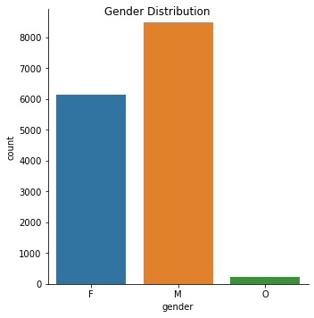

The customers in this dataset consists of 57% male, 41% female and 1% others. Distribution between male and female, though it's 16% difference, we can still consider this as balance for now.

From age, we are able to generate two new features, age group and generations. With many varying groupings out there, since the data is from 2018, we are going to make use of the following grouping.

_Age Group:_

* 18-25: Young
* 26-40: Adult
* 41-60: Middle Age
* 61-100: Old

_Generations:_

* 17-21: Generation Z
* 22-37: Millennials
* 38-53: Generation X
* 54-72: Boomers
* 73-101: Silent

Extracting these groups will help us further understand our data more.

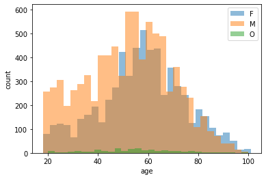

Ages 50-60 has the most coffee drinkers [mean: 54.4, median: 55, mode: 58]. This age threads within `middle_age` and `boomers` as throughout the analysis, these groups spends more on coffee. The gender distribution of persons in profile, both male and female peaks at around ages 50-60 as well.

Moving on to membership, the data ranged from 2013 to 2018. Through these years we can see consistent increase in membership with a dip in 2018, maybe because the membership data ended midway that year (July 2018). Each year, there are more new male joiners than female except for the year 2016, but only at a very small margin.

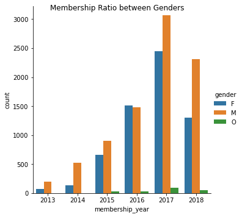

Along with the membership, there's a sudden surge of new joiners from August 2017 to January 2018. This is consistent across different age group and generations.

This surge got me more curious that I searched more statistical facts about coffee drinkers. Some of the statistics presented here are somehow close the the website I [found](https://disturbmenot.co/coffee-statistics/).

**Data Cleaning**

Again, the person id here is in GUID format and it'll be easier going forward if we set them in integer. Based from my experience with this study, while testing out some queries and feature engineering, I have a handful of customers/persons I go to and it's easy for them to be memorized since I set them into number.

Another thing is, there's a surge in age `118` in this dataset. Coincidentally, when age is null, the age is always 118, which got me thinking "Why 118?" It looks like, since dates in some languages are not nullable, and SQL does not support a super minimum date value, Starbucks just set their minimum date to 1900, which if the data is in 2018, the age is `118`. Therefore, for consistency, I set all age with 118 to null.

### Transcript

This dataset is the part where I read the documentation repeatedly just to get an understanding of what's going on. This is also the most important table among the three. Transcript dataset contains series of events for customers. The dataset contains, the person, offer given, and the event type, time in integer hours, amount and the reward.

The event type here are: transaction, offer received, offer viewed and offer completed.

* transaction - event when the customer performs a purchase. In this event, amount is populated, but no offer. It is not documented how transaction relates to any offer. However, there's a certain documented behavior of how the offer gets completed. Think of it this way: During the time the customer started to receive the offer and up until the duration, the customer is accumulating amount until it reaches the difficulty, which by then, the customer receives the reward. That's why it always coincides that if the current transaction already fulfills the difficulty, offer completed is also available with the same time as the transaction. Another tricky aspect is to tie up are informational offers, which has no offer completed event. In the document, the business assumed that any transactions done during the promo duration will relate to the information offer. Since there's no difficulty, the offer is completed right away.
* offer received - event when customer receives the offer through any of the channels
* offer viewed - event where the customer opened and, perhaps, reviewed the offer .This can be a determining factor if any purchase is triggered by the offer.
* offer completed - event recorded when customer completes an offer. This, however, does not record any completion of informational offers. Refer in the transaction type section on how we can make them connect later.

As these event also represents the lifecycle of customer purchase, we can see the downward trend as shown below.

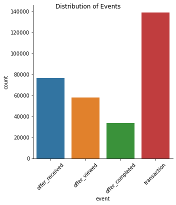

With these events and information gained, we are able to compress and summarize the transcript and find out the success rate of promotions. Compressing them will have the following four outcomes.

* successful
   - the offer was received, viewed and completed
* successful without offer
   - the offer was received and completed even without viewing it
* failed
   - the offer was received but never been viewed nor completed
* viewed but failed
   - the offer was received and viewed but never completed

Among this four scenarios, we can say that the only successful offer is the first one. The other scenarios failed as the offer is never effective for the customer.

The time feature on the other hand is the running time of the experiment starts at 0 up until the experiment is over. The maximum value of time is 714 and since this is represented in hours **714/24 = 29.75 (~30 days or a month)**. It means that the experiment ran for a month.

We also found out that there are different waves where the customer receives offer. Waves are all the same across offers, meaning they are received all at the same time, but randomly both who receives it and what offer they receive.

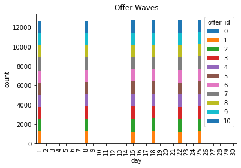

Based on this graph, the offers are sent on days 1, 8, 15, 18, 22 and 25. The first 3 waves are weekly, then afterwards, they were done twice a week. Also, just visualizing the graph, we can see that the offers sent out are somehow in proportion with other offers.

**Data Cleaning**

Since offer and person are also encoded here as GUID, I need to change them as well accordingly.

### Notes

You maybe wondering, how did I generate these graphs. These are easy to create once you familiarize yourself with `python` and `jupyter notebook` along with libraries `pandas`, `numpy` and graphing with `seaborn` and `matplotlib`. I think these are the necessary competencies to learn before tackling the role of a data scientist, as these will let you traverse your data easily.

## Analyzing the Initial Experiment

Now let's go to the harder part of our data science process where we try to explore our data and do hardcore math to prove if the experiment is successful. I think if you're having a coffee, you may need a refill before we start. Don't worry, I have no background in statistics, and most of my knowledge came from Udacity and YouTube, and I was able to perform these part of our study using the easiest way possible, which I think you can do too.

### Enriching our Data

To be able to perform our analysis effectively, we need to shape our data and enrich them to aid us better in our study.

**Transcript Group**

While the transcript is in running time format, it'll be good to compress and flatten them to summarize what happened per offer group and customer. Since the duration of offer is not uniform, we observed, that the latest offer replaces the old one as the active offer. Also we've learned that only one offer per customer are given per wave. This is where the complex transformation comes in, which required me to create a little logic behind transformation to achieve this one. In the end I was able to flatten the transcript with the following new features.

* wave - the current wave for an offer. This is captured by getting the date range of in between offer received events and numbered them from 1-6. All events in between those date range are set with the corresponding wave number.
* diffs - the average time difference in between events. This will be handful later when designing an offer. This was taken by performing a running diff on a sorted time data group per customer. The first event is always 0, therefore, to normalize the mean difference in the flatten format, the first one's value is replaced by the mean of the diffs.
* received, viewed, completed - they are now columns with bool values when these events are met. Viewed are discarded if they are done after the offer is completed, therefore set to false.
* purchased - it's a bool summary if the customer has received, viewed and completed the offer, thus a successful offer.
* amount - this is now sum amount spent related to offer. This is calculated by getting all the transactions needed to complete the offer. Then getting the sum of that transaction.
* non_offer_amount - this is the sum amount spent not related to offer. This is the sum of all other transactions if there are no active offers or the current offer is already been completed.
* mapped_offer - based on our understanding of how transcript works, we have able to successfully map the offer to any events. This is the active offer on the current wave.
* spendings - amount + non-offer amount, sums up the amount spent on each waves
* recommended_offer - the offer ids only if the offer is successful (purchased=true)

Aside from these, portfolio and profile dataset are also merged with this dataset. The entire transcript is right merged with the profile dataset to capture those who are not given any offer and didn't do anything during those wave period.

### Q1: Which offer yields the best results?

#### Incremental Response Rate

Before we begin any experiment analysis, we need to decide first which metrics to use to answer the question. As we are trying to look for the best offer, we define that the success is based on the increased response rate of our users between the treatment and control group. 

* Treatment Group
  * Customers who are given offers, and information if they have completed the offer (purchased = true)
* Control Group
  * Customer who are not given offers and information if they still purchase any product regardless (non_offer_amount > 0)

This method of experiment is what we call **A/B/N testing** since we have more than 1 offer to compare with the control group. Take note that with A/B/N testing, comparisons should be independent from each other.

Before we proceed to the mathematical side of things, here's the distribution graph between the 2 groups. Visually, we can see that the failure rate is higher in the treatment group than the control group.

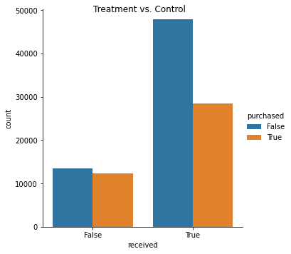

Starting here, we are going to refer to the number of customers as `n`. `X` will be the sum of our observed field (purchased).

To calculate the response rate, here's our formula.

$$
IRR = \frac{X_{tr}}{n_{tr}} - \frac{X_{ct}}{n_{ct}}
$$

or

$$
IRR = \bar{X}_{tr} - \bar{X}_{ct}
$$

In other words, IRR is the difference between the purchased mean between treatment and control.

#### Invariant Test

The invariant test is the test we need to perform if the data on hand will have statistical significance to resume our analysis. 

We already have a good amount of samples (greater than 5000) and since we are testing rates, we don't need to perform sample size test. Also with our large sample size, we can say that we have good enough statistical power to resume our study.

Another thing we can look at is the proportion of sample sizes between control and treatment group.

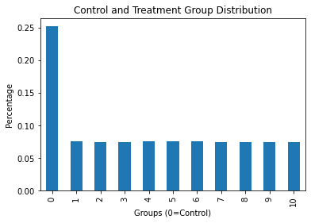

The next step is the comparison between control group and all combined offers.

The treatment group is at 76277 and the control group is 25723. This puts us at 75 (treatment) : 25 (control), based on the study done [here](https://www.markhw.com/blog/control-size) 25% is just at the sweet spot, before the statistical power drops significantly.

Doing the reverse, comparing with them individually, it shows the good amount of control group which is not going to be a problem since we are testing rates.

#### Statistical Test

Since the metrics we've chosen is whether the purchase is successful with or without offer, this corresponds to a `Bernoulli` population. Also, our sample size is more than 10, therefore we have enough samples to perform `z-test`. Basically `z-test` is finding out the z-score our data and from that getting the P-Value (the line on a z-score diagram). Also, before we can perform the test, we need to identify our hypothesis.

**Test Details**

Significance Level: 0.05

Type: Upper Tailed Z Test

Hypothesis:
$$
H_0: \bar{X}_{tr} \leq \bar{X}_{ct}
$$
$$
H_1: \bar{X}_{tr} > \bar{X}_{ct}
$$

So that we can successfully reject the null hypothesis (meaning the experiment is successful), we need our P-Value < Significance Level.

**Results**

Z-Score: -30.02

P-Value: 1.0

Therefore, we failed to reject the null hypothesis, meaning giving out offers will not increase the response rate of the customer. They will still go buy the product regardless if there are offers or not.

**Individual Offer Results**

| offer | z_score  | p_value     |
| ----- | -------- | ----------- |
| 1     | -20.9618 | 1           |
| 2     | -17.1352 | 1           |
| 3     | -39.7113 | 1           |
| 4     | -31.7136 | 1           |
| 5     | -49.7873 | 1           |
| 6     | 14.83844 | 4.13E-50    |
| 7     | 20.94418 | 1.06E-97    |
| 8     | -10.9625 | 1           |
| 9     | -1.22665 | 0.890022991 |
| 10    | -31.6716 | 1           |

As we can see in our individual offer test, only offers 6 and 7 passed, in which the latter has better score.

* **Offer 7**: Discount at 10 difficulty with reward of 2 and duration of 10
* **Offer 6**: Discount at 7 difficulty with reward of 3 and duration of 7

#### Practical Test

Let's say we have an average price of product at 8, and given the cost of promotion of 0.15 each channel (4 channels is 0.6 in total). We need an increase of 0.075 response rate to breakeven. For this exercise, we'll adjust it to 0.10 to still have a revenue from the offer. Also, since our sample size is not proportional, we are going to use the unpooled version of the standard error.

**Test Details**

Practical Significance Boundary: 0.10

Standard Error: Unpooled

Type of test: Confidence Interval

Z: 1.645 (upper tail 95%)

In order that our practical test to be successful, both ends of our confidence interval should be greater than our practical significance boundary.

**Results**

Confidence Interval

* min: -0.11
* max: -0.09

Standard Error: 0.004

Margin of Error: 0.006

Difference: -0.11

We can see that both range didn't meet the practical significance boundary. Therefore, we can say that the offers are not statistically significant and weren't able to improve the incremental response rate of the customer.

**Individual Offer Results**

| offer | lower    | upper    | se_up    | z_score  | moe      | diff     |
| ----- | -------- | -------- | -------- | -------- | -------- | -------- |
| 1     | -0.14508 | -0.1245  | 0.006256 | 1.644854 | 0.010291 | -0.13479 |
| 2     | -0.12136 | -0.10047 | 0.006349 | 1.644854 | 0.010443 | -0.11091 |
| 3     | -0.25934 | -0.2405  | 0.005729 | 1.644854 | 0.009424 | -0.24992 |
| 4     | -0.21113 | -0.19145 | 0.005982 | 1.644854 | 0.009839 | -0.20129 |
| 5     | -0.31586 | -0.29839 | 0.005309 | 1.644854 | 0.008733 | -0.30712 |
| 6     | 0.085706 | 0.106943 | 0.006456 | 1.644854 | 0.010619 | 0.096324 |
| 7     | 0.125313 | 0.146353 | 0.006396 | 1.644854 | 0.01052  | 0.135833 |
| 8     | -0.08174 | -0.06058 | 0.006433 | 1.644854 | 0.010582 | -0.07116 |
| 9     | -0.01875 | 0.002726 | 0.006527 | 1.644854 | 0.010737 | -0.00801 |
| 10    | -0.21135 | -0.19164 | 0.005993 | 1.644854 | 0.009858 | -0.2015  |

Since we have set our practical significance boundary at 0.10, on this part of test, only **Offer 7** passed. Offer 6, even though it has positive results, the lower end of the interval does not pass with our boundary, thus failed.

#### Summary

In summary, we do have only one clear winner to answer the question and that is **Offer 7**, a discount type offer with difficulty of 10 and a reward of 2 lasting for 10 days. The second one is **Offer 6** however, it did not pass our practical test. The worst one on both tests is **Offer 5**, a discount type with very high difficulty of 20 and a reward of 5 lasting for 10 days.

### Q2: Which offer makes the customer spends more?

#### Incremental Revenue Rate

More spending means more revenue. However, we need to put into account the amount we are losing by giving rewards and sending the offers. Since we don't have a good balance between treatment and control, we are going to make use of individual revenue rate instead. The revenue are computed differently between treatment and control group.

$$
rev_{tr} = amt_{tr} - rwd_{tr} - ((ch_{email} + ch_{web} + ch_{mobile} + ch_{social}) * 0.15)
$$

$$
rev_{ct} = amt_{ct}
$$

For the treatment group, getting just the amount spent for the offer will not be good enough to calculate revenue. We need to subtract the reward and the cost sending out the offers (0.15 each). What we want here is to determine how offers influence the spending patterns, therefore, we are going to add the non-offer to the offer amount as part of the spending of the customer during that period.

* Treatment Group
  * Customers who are given offers, and revenue information
* Control Group
  * Customer who are not given offers and revenue information

Before we begin, let's quickly visually compare the 2.

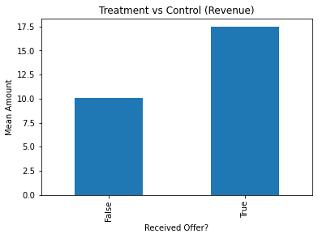

Visually, we can immediately see that the treatment group is indeed influencing the customers to spend more. Let's use statistical analysis to have a closer look.

#### Invariant Test

Similar to our previous test, one very noticeable observation is that the sample size are not in equal proportion. With the large amount of data, we don't need to perform normality test.

The control sizes are also within acceptable range, with that we can proceed with our test.

#### Statistical Test

The metrics we've chosen are difference in mean, therefore, this does not correspond with Bernoulli population. Another noticeable thing is that we have unequal proportion between groups, so we are going to make use of unpooled way of calculating the standard error. Lastly, the population variance is unknown, therefore the test that we'll be doing is a t-test.

**Test Details**

Significance Level: 0.05

Type: Upper Tailed T-Test

Hypothesis:

$$
H_0: \bar{X}_{tr} - \bar{X}_{ct} \leq 0
$$
$$
H_1: \bar{X}_{tr} - \bar{X}_{ct} > 0
$$

So that we can successfully reject the null hypothesis (meaning the experiment is successful), we need our P-Value < Significance Level.

**Results**

T-Score: 29.53

P-Value: 0.0

Degrees of Freedom: 61297.097

Actually, the p-value is very close to zero at 1.39e-190, for readability, I just set it to zero. Since it is less than the significance level, we reject the hypothesis. Meaning the offers somehow influenced the customers to spend more.

**Individual Offer Results**

| offer | t_score  | p_value   | df       |
| ----- | -------- | --------- | -------- |
| 1     | 13.43409 | 4.35E-41  | 9863.8   |
| 2     | 11.79593 | 3.36E-32  | 9828.344 |
| 3     | 9.948234 | 1.60E-23  | 11241.02 |
| 4     | 8.793543 | 8.38E-19  | 10515.33 |
| 5     | 7.898408 | 1.55E-15  | 10546.34 |
| 6     | 20.48883 | 1.03E-91  | 9951.663 |
| 7     | 23.1078  | 3.57E-115 | 9158.603 |
| 8     | 13.77922 | 3.65E-43  | 11799.91 |
| 9     | 14.18089 | 1.72E-45  | 9575.73  |
| 10    | 12.96391 | 1.94E-38  | 10348.6  |

Consistently, **Offer 7** wins again followed by **Offer 6**, and no surprise that **Offer 5** performs the worst.

#### Practical Test

For the practical test side, we are going to assume that the level of influence should make the customer buy additional coffee. We don't know the price of the coffee, but the average amount spent for offers is 8.18. To simplify our boundary, we'll set it to **10.0**.

**Test Details**

Practical Significance Boundary: 0.10

Standard Error: Unpooled

Type of test: Confidence Interval

T: 1.645 (upper tail 95%)

In order for our practical test to be successful, both ends of our confidence interval should be greater than our practical significance boundary.

**Results**

Confidence Interval

* min: 6.98
* max: 7.80

Standard Error: 0.25

Margin of Error: 0.41

Difference: 7.39

Degrees of Freedom: 61287.097

Even though the intervals are in the positive direction, they failed to reach our practical significance boundary on both ends.

**Individual Offer Results**

| offer | lower    | upper    | se_up    | t_score  | moe      | diff     | dof      |
| ----- | -------- | -------- | -------- | -------- | -------- | -------- | -------- |
| 1     | 6.591651 | 8.431204 | 0.559132 | 1.645008 | 0.919776 | 7.511427 | 9863.8   |
| 2     | 5.623977 | 7.446765 | 0.554036 | 1.645009 | 0.911394 | 6.535371 | 9828.344 |
| 3     | 3.782596 | 5.281367 | 0.455556 | 1.644989 | 0.749385 | 4.531981 | 11241.02 |
| 4     | 3.601982 | 5.259733 | 0.503876 | 1.644999 | 0.828876 | 4.430857 | 10515.33 |
| 5     | 3.131539 | 4.779081 | 0.500773 | 1.644998 | 0.823771 | 3.95531  | 10546.34 |
| 6     | 10.33405 | 12.13831 | 0.548405 | 1.645007 | 0.90213  | 11.23618 | 9951.663 |
| 7     | 13.89106 | 16.02043 | 0.647216 | 1.64502  | 1.064684 | 14.95575 | 9158.603 |
| 8     | 5.230801 | 6.649032 | 0.431078 | 1.644983 | 0.709116 | 5.939916 | 11799.91 |
| 9     | 7.266238 | 9.173253 | 0.579636 | 1.645013 | 0.953508 | 8.219745 | 9575.73  |
| 10    | 5.793243 | 7.477131 | 0.51182  | 1.645001 | 0.841944 | 6.635187 | 10348.6  |

We only have two offers passed this time, **Offers 6 and 7** with both ends are greater than our practical significance boundary. Answering the question, **Offer 7** is still the best offer, **Offer 5** is still the lowest.

#### Summary

We do have two offers this time that passed both statistical and practical test, **Offers 6 and 7** giving the latter winner again on this round. The difference between offers 6 and 7 is that the former has lower difficulty of 7, higher reward at 3, but shorter duration at 7.

### Notes

You may need to refill your coffee agajn, as we are done with the mathematical part of our study. Before we end this section, I will give some notes on how I did the experiment analysis.

I will provide the Github link below for you to find out how I calculated the values. Z-Test and T-Test are done easily using `statsmodel` which has methods for both (`ztest` and `ttest_ind` respectively). They also have parameter where you can set depending on the nature of your alternative hypothesis (lower, upper or two-tailed). For practical test however, I can't find any library that performs the things I want, that's why I created a method that calculates them based on the mathematical formula for confidence interval.

In regards to how I chose the type of test, I followed a flow chart discussed in this [link](https://www.youtube.com/watch?v=6uw0A3aKwMc). It's easy to follow, once I know the type of test, all I did was either research for the formula or find a library that performs it.

## Designing the Next Experiment

We are splitting the last question in this section, as the question deals with the machine learning part of our study.

### Q3: In preparation for the next experiment, how can we make use of the result to improve our offering to customer?

Based on our analysis in the previous section, random targeting of offers is not that efficient in improving the response rate of the customer. Based on my personal experience, drinking coffee is already a habit for me and I will buy it regardless if there's a promotion or none. However, this is not always the case for everyone as certain demographics are still affected by offers.

There are two things we can target.

* The first one is to determine which demographics are likely to respond to offers. This way we are not going to lose money if we send out offers for those who are not affected
* The second one is to determine which offers is effective for a certain demographic of an individual.

These two corresponds to individual models and we separate them for flexibility. Here are some scenarios.

* Starbucks may decide to create new offers based on the result of the study. You will then need only the first model where it determines whether the profile of individual is more likely to be affected by offers
* Maybe, the customer is not responding because he/she was given with the wrong type of offer. in this scenario, we are going to use the second model, which predicts which offer to give to the customer
* Or, they want to maximize the revenue by first determining who will receive offer, and then using the second model to determine which offers to give.

### Part 1: Who should be given out with offers

For the first part, we only need data that relates to the customer, which is the profile dataset. During training, we just need to determine if the offer given to the customer is effective or not (purchased=true), we are going to merge this information along with the customer profile to create the data for training.

#### Data Cleaning

It is useless to add the anonymous customers in our training data, as we don't have any distinguishing information from them that may influence the effect of the promotion. With that, we are going to remove them from our training data. Aside from that, we will further filter the data for those who received the offer only and how they reacted to it. This way we'll know if effective or not. We are also going to extract additional information to enrich our training model such as the age groups and generation.

**Steps**

1. Load the summarized transcript (`transcript_group.csv`). Refer to the "Enriching our Data" section above for the feature engineered details.
2. Remove anonymous customer with no age, income and gender (`transcript_group.age.isna()`). These information are what we are going to rely on in training the model.
3. Remove also those who did not receive the offer (`transcript_group.received == False`). They didn't have any interaction with the offers, therefore we will never know how they reacted to the offer.
4. We are going to simplify the `gender` as `1` if male and `0` if female. However, there are around 200 that have other as gender. We are going to use **Multivariate Imputation by Chained Equation** in imputing those genders. This technique tries to look for the best prediction from other columns to fill out the missing value.
5. Remove outliers in income using tukey rule.
6. Select fields `purchased`, `gender`, `age`, `income`, `membership_year`, `membership_month`, `membership_day`, `generation` and `age_group`.
7. Dummify `generation` and `age_group`

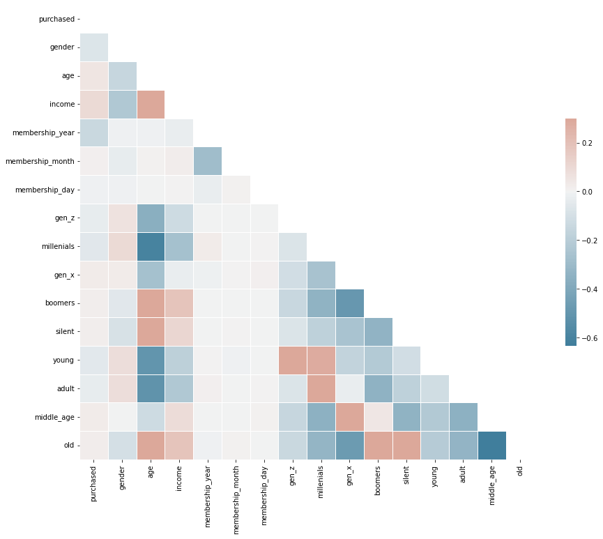

#### Model Training

We are going to use a binary classification for this one using `purchased` as response variable. For the algorithms, we tried out a bunch, but to limit it to top 3 we selected `LogisticRegression`, `DecisionTreeClassifier` and `KNeighborsClassifier`. As we are still trying to find out the best algorithm to use, we are going to use their default parameter settings. 

We are going to feed them for hyper parameter tuning to find out the best parameters for our training model.

**Metrics**

We'd like to have a balance between precision and recall, as this is only for experiments. Our target is to at least provide us a good amount of predicted customers that we are giving out offers. With this I used the **weighted average f1-score** metrics as our main metrics. Along with other metrics, we are going to get this through classification report.

**Results**

| LogisticRegression | DecisionTreeClassifer | KNeighborsClassifier |
| ------------------ | --------------------- | -------------------- |
| 0.467353           | 0.608990              | 0.596040             |

Selecting **DecisionTreeClassifier**, I further tried to perform tuning and able to improve the result a little. The resulting best parameters (in bold) are:

* class_weight: [**None**, balanced]
* criterion: [gini, **entropy**]
* max_features: [auto, sqrt, log2, **None**]
* splitter: [**best**, random]

The weighted average f1-score is **0.6100730914664464**.

#### Summary

**DecisionTreeClassifier** yields the best result, however the difference is not far from **KNeighborsClassifier**. These are both non-parametric algorithms, however, decision trees has automatic feature selection where it tries to give weight to features that are highly related to the response variable.

The model, however, is not performing very well at **0.61**. Since we are going to use this for our next experiment we are hoping to get more features from the customer and more definite interaction details with offers that can improve our models later on. For now, our data is very limited to improve the performance of the model.

### Part 2: Which offer should we give out?

Examining the current data that we have, this can be answered by creating a recommendation system for the customer. The way we do it, however, is by applying which offers are effective for a customer and using that information, we will be able to perform a multi-output classifier.

#### Data Cleaning

Before we can proceed with the training, we need to flatten further our training group dataset and extract only the successful offers per customer. This data will serve as our response variable. In out dataset, all unsuccessful and no offers received are removed since we are no longer going to use them.

**Steps**

1. Load the summarized transcript (`transcript_group.csv`). Refer to the "Enriching our Data" section above for the feature engineered details.
2. Remove anonymous customer with no age, income and gender (`transcript_group.age.isna()`). These information are what we are going to rely on in training the model.
3. Remove all transactions that did not receive any offer (`transcript_group.received == False`)
4. Remove all unsuccessful offers, we are only interested on the successful ones (`transcript_group.purchased == False`)
5. Simplify gender, using 1 for male and 0 for female. Use MICE again for imputing the "others" data.
6. Flatten the data by grouping using person id and wave id as keys. Implode the successful offers into an array column (`recommended_offers`), and the rest get the following fields: `gender`, `age`, `income`, `membership_year`, `membership_month`, `membership_day`.
7. Dummify `recommended_offers`

Here's the distribution of offers after cleaning.

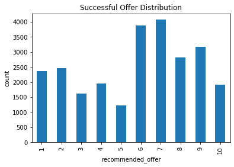

We can see that there's a bit of imbalance across different offers, but not that significant.

After cleaning, we are going to dummify all categorical variables and prepare for model training.

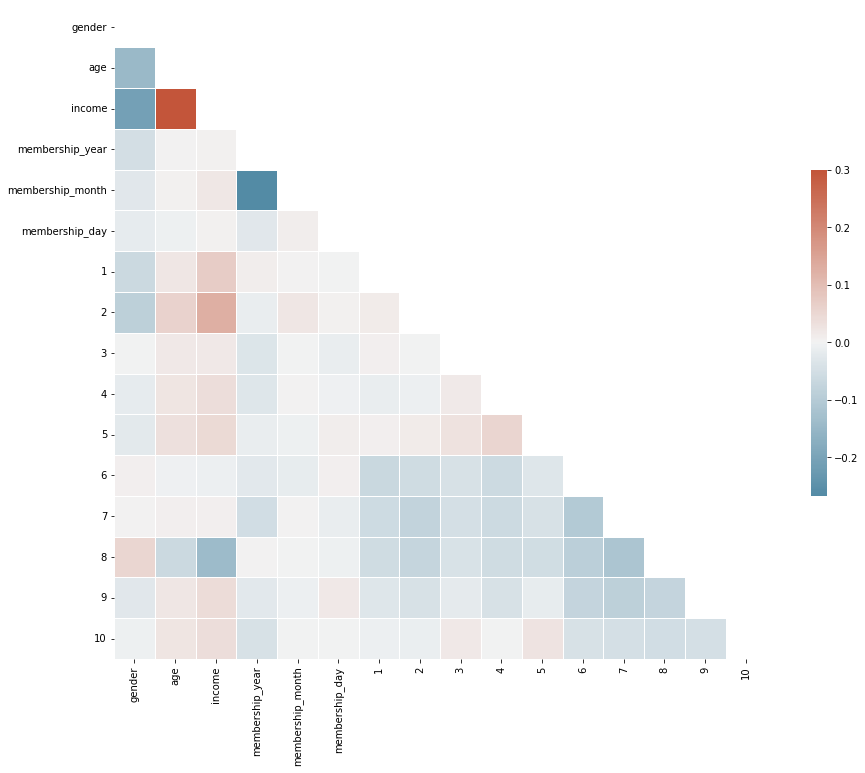

#### Model Training

We are going to perform multi-output classification, and again algorithms are pre-selected for those in the top 3. We've chosen `KNeighborsClassifier`, `DecisionTreeClassifier` and `ExtraTreeClassifier` as estimators for our `MultiOutputClassifier`.  For these models, as we are still trying to select the best one, we are going to use their default parameters. Since these are straightforward model training, no issues found when coding and training the model.

For the data, we need `y` to be dummified recommended offers, while `X` are customer features.

**Metrics**

Again, these are for experiments, and we'd like to have a balance between precision and recall while having a good amount of distribution and sample across different offers. Therefore we are going to make use of **weighted average f1-score** for our main metrics. We'll be using, again, classification report to get this value along with other information.

**Results**

| KNeighborsClassifier | DecisionTreeClassifier | ExtraTreeClassifier |
| -------------------- | ---------------------- | ------------------- |
| 0.146817             | 0.253306               | 0.243753            |

Again, **DecisionTreeClassifier** won this round. I further tune it, but got only very little improvement. The resulting best parameters (in bold) are:

* class_weight: [**None**, balanced]
* criterion: [gini, **entropy**]
* max_features: [auto, sqrt, log2, **None**]
* splitter: [**best**, random]

The weighted average f1-score is **0.2560590665020447**

#### Summary

The performance on the second part is still bad at **0.26**, however, with very limited features that we can work with this is as far as I can get. My recommendation still is to make use of this model to perform the next experiment and gather more data and perhaps the behavior will get fine tuned once we implement this model.

On this round, **DecisionTreeClassifier** won followed by **ExtraTreeClassifier**, which are both tree algorithms. The automatic feature selection on the trees made more visible as their difference with **KNeighborsClassifier** or more significant.

## Conclusion

Your third coffee might be halfway done by now. We learned a lot of things in this study.

### Reflection

The project is about applying the data science process on the data provided by Starbucks. Because of this project, I am able to expand my knowledge even beyond to what I learned from Udacity's Data Science Nanodegree program. I am able to craft my own workflow process that I will call my own.

**Project Structure**

The first that I am proud of is I am able to create my own project structure that is easy to work on. I am able to organize my notebooks, data and models. Aside from that, I found a way that I no longer worry about how to access my codes, by converting the entire project into an installable pip library.

**Pre-Processing**

Right out of the bat, I am faced with challenges on how to deal with `json` as I am more used to working with `csv` files. Then, another weird thing is that the ids are all in `GUID`. My experience with SQL helps me craft how I can replace the values of portfolio, profile and transcript ids from `GUID` to integer.

**Data Understanding**

With not so much of documentation about the data, this is where I spent most of my time in doing the project, understanding the data especially the transcript dataset, looking for patterns that I will need to use to get the data I want. There's also no direct mapping of SQL to transform the data, I pulled out all my skills in software development to create a custom code just to transform the data. I even made it sort of OOP (Object Oriented Programming) style to reduce complexities.

**Experiment Testing**

This is where I struggled the most. The lesson I learned from Udacity is specific only to a certain problem, that when I have situations different to what they taught me, I don't know how to tweak it since I don't have any heavy statistics background. Luckily I came across some different resources that simplifies my understanding.

**Model Training**

Getting frustrated from low performance of the model, I spent days trying to research how further improve the models, but unfortunately, the limited data forced me to accept their current low performance. I tried performing feature engineering by getting the amount spent by each customer and during training, I created a model to predict the amount the the customer will spent. However, it just made the model performance worst, so I didn't include that in this study.

### Summary of Findings

* As you grow older, the love for coffee becomes unconditional, whether there are offers or not. As majority of our customers are at the boomers or middle age, we can see that offers won't affect the response rate of the customers. However, there are still other customers in the age group that are affected, which maybe we can handpicked specifically in our next experiment
* Offers may not improve the response rate, however, it does push customers to spend more. As a customer myself, drinking coffee is also contagious that simply pulling in people in the store, we encourage other customers to buy drink, or to buy drink for someone else. Offers have that effect, and during promotions, these maybe the times that we feel generous.
* Buy-one-get-one may sound appealing to some, the effect is not that much for coffee drinkers based on the study we performed. The best offers are the discount types that are easy to avail of and the worst one are those with difficulty that are super high.
* Experiments are cycles sometimes, if we don't get the best performing models on this round, we'll make use of what we have to create another round of experiments, hoping in the next one, we'll get more customers.

And this is the end of my journey in this study. This could be much easier if you statistics background. However, as most new learnings, we got to start somewhere and various libraries really help me calculate complex formulas. I posted links below and some of them helped me to select the best algorithm and find out the libraries I need to execute the things I want. I hope they can help you too.

And, lastly, the format of this blog is somehow close to CRISP-DM methodology, but this is blown up in detail in my project space. Be sure to check it out [here](https://github.com/netxph/sb-capstone).

### Improvement

Relying to just the 3 features, age, gender and income is not enough to get a good performing model. My recommendation is to work on getting additional features from customer either giving out bonus points to the customer if he completes his profile, or send out survey in exchange for rewards.

Another thing for the next experiment is to add more either new offerings or flexible offerings where we can tweak reward, difficulty and duration based on the customer we are targeting.

It would be nice also for the transcript if we could add like the actual days or days of week for us to find out if the customer is building a habit or not. Another feature that is worth getting is the product they are getting and the size. These new features will move us closer in creating customer segmentation.

## Resources

https://digital.hbs.edu/platform-digit/submission/starbucks-mobile-app-a-winner-in-bridging-the-retail-digital-divide/

https://www.youtube.com/watch?v=XxK1PyaF1bw

https://disturbmenot.co/coffee-statistics/

https://www.markhw.com/blog/control-size

https://github.com/tirthajyoti/Stats-Maths-with-Python/blob/master/Intro_Hypothesis_Testing.ipynb

https://www.youtube.com/watch?v=6uw0A3aKwMc

https://github.com/netxph/sb-capstone

